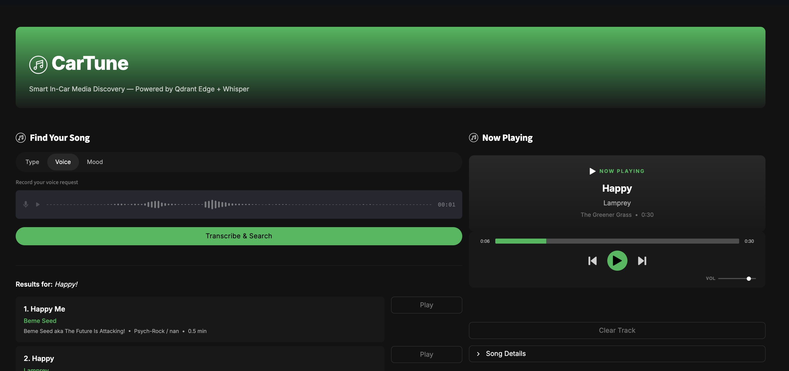

# CarTune: Smart In-Car Media Discovery System



**CarTune** is a modern, **offline-first** music discovery platform designed for in-car infotainment systems. Drivers can find and play songs hands-free using **voice**, **natural-language text**, or **mood** searches — all powered by local AI models running entirely on the device.

By moving embeddings, vector search, and audio playback off the cloud, CarTune delivers **zero latency** and **privacy-first** media discovery — essential for the next generation of smart vehicles.

> *Built with Qdrant Edge + Whisper + FastEmbed — No internet required.*

---

## Key Features

| Feature | Description |
|---------|-------------|
| **Real Audio Playback** | 8,000 royalty-free MP3s from the Free Music Archive — played through a custom Spotify-styled HTML5 audio player |
| **Voice Search** | Tap once and speak. OpenAI Whisper (`small`) transcribes entirely on-device |
| **Text Search** | Natural-language queries like *"upbeat hip hop"* or *"calm folk acoustic guitar"* |
| **Mood Search** | One-tap mood buttons (Happy / Sad / Energetic / Chill / Romantic / Party) |
| **Vector Search** | 7,994 songs embedded with FastEmbed `all-MiniLM-L6-v2` (384-dim) stored in Qdrant Edge |
| **Spotify-Style UI** | Dark theme, green accents, pill-shaped controls, Inter font, custom PNG icons |
| **Zero Cloud** | Whisper, FastEmbed, Qdrant Edge, and audio files all live on disk — works in airplane mode |

---

## System Architecture

```
                    ┌─────────────────────────────┐
                    │   User Input                │
                    │   (Voice / Text / Mood)      │
                    └─────────────┬───────────────┘
                                  │
                    ┌─────────────▼───────────────┐
                    │   OpenAI Whisper (local)     │
                    │   Voice → Text transcription │
                    └─────────────┬───────────────┘
                                  │
                    ┌─────────────▼───────────────┐
                    │   FastEmbed (all-MiniLM)     │
                    │   Text → 384-dim vector      │
                    └─────────────┬───────────────┘
                                  │
                    ┌─────────────▼───────────────┐
                    │   Qdrant Edge Shard          │
                    │   Cosine HNSW ANN Search     │
                    │   7,994 indexed songs         │
                    └─────────────┬───────────────┘
                                  │
                    ┌─────────────▼───────────────┐
                    │   Streamlit UI               │
                    │   Spotify-styled player       │
                    │   Real MP3 playback           │
                    └─────────────────────────────┘
```

---

## Project Structure

```
cartune/
├── app.py                      # Streamlit dashboard (Spotify-styled UI)
├── requirements.txt            # Python dependencies
├── pyproject.toml              # UV packaging config
├── README.md                   # This file
│
├── icons/                      # PNG icons (loaded dynamically at runtime)
│   ├── music-note.png          # Branding / header icon
│   ├── play-buttton.png        # Play control icon
│   ├── play.png                # Skip-next control icon
│   └── video-pause-button.png  # Pause control icon
│
├── fma_small/                  # 8,000 royalty-free MP3s (Free Music Archive)
│   ├── 000/000002.mp3
│   └── ...
│
├── data/
│   ├── songs.csv               # Unified metadata (7,994 rows)
│   ├── qdrant_shard/           # Local Qdrant Edge vector database
│   └── display.png             # App screenshot
│
├── scripts/
│   └── prepare_dataset.py      # Scans fma_small/ → builds data/songs.csv
│
└── src/
    ├── config.py               # Central paths + model identifiers
    ├── ingest.py               # FastEmbed → Qdrant Edge ingestion pipeline
    ├── search.py               # Semantic vector search over the shard
    ├── voice.py                # Whisper voice transcription
    ├── player.py               # Real MP3 playback state manager
    ├── audio_player.py         # Custom HTML5 audio player widget
    └── icon_loader.py          # Dynamic PNG icon loader from icons/ folder
```

---

## Data Pipeline

```
fma_small/ (8,000 MP3 files)
        │
        │  scripts/prepare_dataset.py
        │  (mutagen ID3 tag extraction)
        ▼
data/songs.csv (7,994 rows × 13 columns)
        │
        │  src/ingest.py
        │  (FastEmbed all-MiniLM-L6-v2, 384-dim)
        ▼
data/qdrant_shard/ (Qdrant Edge, Cosine HNSW index)
        │
        │  src/search.py
        │  (Text / Voice / Mood semantic queries)
        ▼
app.py (Streamlit UI)
        │
        │  click "Play"
        ▼
src/player.py → loads MP3 bytes from disk
        │
        ▼
Custom HTML5 Audio Player → real browser playback
```

---

## Why Qdrant Edge?

CarTune uses **Qdrant Edge** — an embedded, on-device vector database — instead of cloud-hosted alternatives. Here's why:

| Aspect | Qdrant Edge | Cloud Vector DBs |
|--------|-------------|-------------------|
| **Latency** | <10ms (in-process) | 50-200ms (network round-trip) |
| **Privacy** | All data stays on device | Data sent to external servers |
| **Connectivity** | Works offline | Requires internet |
| **Deployment** | Single shard file on disk | Docker/Kubernetes cluster |
| **Cost** | Free, no API keys | Pay per query/storage |

For an in-car system where **network connectivity is unreliable** and **response time is critical** (driver safety), Qdrant Edge is the right choice: it runs as a Python library with no server process, stores the entire index as a portable shard on disk, and serves HNSW approximate nearest-neighbor queries in single-digit milliseconds.

---

## Setup & Installation

### Prerequisites
- Python 3.10 – 3.12
- [ffmpeg](https://ffmpeg.org/) — required by OpenAI Whisper
- ~10 GB free disk space (audio + shard + virtualenv)

### 1. Install dependencies
```bash
# Using uv (recommended)
uv venv
source .venv/bin/activate
uv pip install -r requirements.txt

# Or using pip
pip install -r requirements.txt
```

### 2. Download the FMA-small dataset
```bash
wget https://os.unil.cloud.switch.ch/fma/fma_small.zip
unzip fma_small.zip -d .
```
> The FMA dataset is licensed Creative Commons. See https://github.com/mdeff/fma

### 3. Build `data/songs.csv` (one-off)
```bash
python scripts/prepare_dataset.py
```
```
[prep] Scanning fma_small ...
[prep] Scan complete — 7994 usable tracks
[prep] Wrote 7994 rows to data/songs.csv
```

### 4. Build the Qdrant Edge shard (one-off)
```bash
python -m src.ingest
```
```
[ingest] Loaded 7994 unique tracks
[ingest] Embedding done in ~36s (220 tracks/sec)
[ingest] Indexing complete. Shard has 7994 points.
```

### 5. Launch the app
```bash
streamlit run app.py
```
Open `http://localhost:8501` in your browser.

---

## How to Use

1. **Type tab** — Type something like *"upbeat hip hop"* or *"calm folk acoustic guitar"*, click **Search**
2. **Voice tab** — Click the mic, speak your request, click **Transcribe & Search** — Whisper handles the rest
3. **Mood tab** — One-tap any of the 6 mood buttons (Happy, Sad, Energetic, Chill, Romantic, Party)

When results appear, click **Play** on any song. The **Now Playing** panel will:
- Show the track name, artist, album, and duration
- Mount a Spotify-styled HTML5 audio player with real MP3 streaming
- Auto-play the track with play/pause toggle, seek bar, and volume control

---

## Tech Stack

| Layer | Technology | Detail |
|-------|-----------|--------|
| **UI** | Streamlit | Spotify-themed dashboard with custom CSS, Inter font |
| **Icons** | Custom PNGs | Loaded dynamically from `icons/` folder via `icon_loader.py` |
| **Vector Store** | `qdrant-edge-py` | On-device shard, 384-dim Cosine, HNSW index |
| **Embeddings** | FastEmbed | `all-MiniLM-L6-v2`, ONNX CPU inference |
| **Voice** | OpenAI Whisper | `small` model, runs locally |
| **Audio Player** | Custom HTML5 | Spotify-styled with play/pause/seek/volume controls |
| **Metadata** | `mutagen` | ID3 tag parsing from FMA MP3s |
| **Dataset** | Free Music Archive | 8,000 royalty-free MP3 tracks |

---

## License

The CarTune source code is provided as a demo / research project.
The Free Music Archive audio files retain their original Creative Commons
licenses — see https://github.com/mdeff/fma for attribution.
