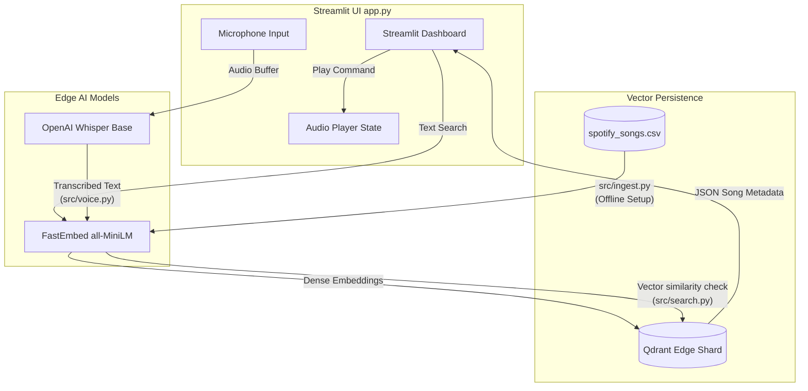

# CarTune: System Architecture & Data Flow

This document outlines the underlying architecture of the CarTune media discovery system. The application operates entirely "at the edge" (100% local, offline-capable) by integrating specialized AI models into a simplified Streamlit interface.

## High-Level Architecture Diagram

---

## Component Breakdown

### 1. Data Ingestion Pipeline (`src/ingest.py`)
Because local LLMs and vector searches require mathematical representation, raw data cannot be queried directly using natural language. 
* **The Process:** We read tabular music features (e.g., genre, energy, danceability) from a flat CSV and use string-formatting to build rich paragraph-like descriptions (e.g., *"An energetic pop song suitable for dancing"*).
* **The Tools:** These textual paragraphs are processed in-memory by **FastEmbed** (`sentence-transformers/all-MiniLM-L6-v2`) which maps them into a 384-dimensional vector space.
* **Storage:** We use **Qdrant Edge**, an embedded vector database that writes directly to disk (`data/qdrant_shard/`), eliminating the need for Docker networks or heavy standalone server processes.

### 2. The Search Engine (`src/search.py`)
Retrieval in an edge environment needs to be fast and low-resource.
* **Execution:** When a user searches for an abstract concept ("chill vibes"), the query is fed directly into the identical FastEmbed model used during ingestion. 
* **Vector Math:** Qdrant instantly calculates the **Cosine Distance** between the generated query vector and thousands of stored song vectors. The closest geometric dots in that 384-dimensional space represent songs that mathematically match the prompt's semantic meaning.

### 3. Edge Auditory Processing (`src/voice.py`)
Routing voice queries locally avoids the round-trip latency of standard web APIs.
* **Stream Handling:** The `<audio>` blob output from the Streamlit frontend is dumped into a temporary `.wav` file buffer using Python's `tempfile`. 
* **Transcription:** The local **Whisper** ("base") instance scans the file. Due to the small model size, this operates rapidly in an offline environment (perfect for in-car deployments), parses the text, returns it to memory, and immediately clears the temporary cached file.

### 4. Interactive User Interface (`app.py`)
The visual frontend handles the orchestration of the underlying engine.
* **Event Loop:** Streamlit acts as an event-driven framework. It triggers `st.spinner` placeholders while blocking the UI just long enough for Whisper to finish transcribing. 
* **State Management:** Uses `st.session_state` to decouple search results from the active "Now Playing" audio simulation. This ensures that opening a dropdown menu or browsing a tracklist doesn't refresh the page and erase the retrieved local AI results.
